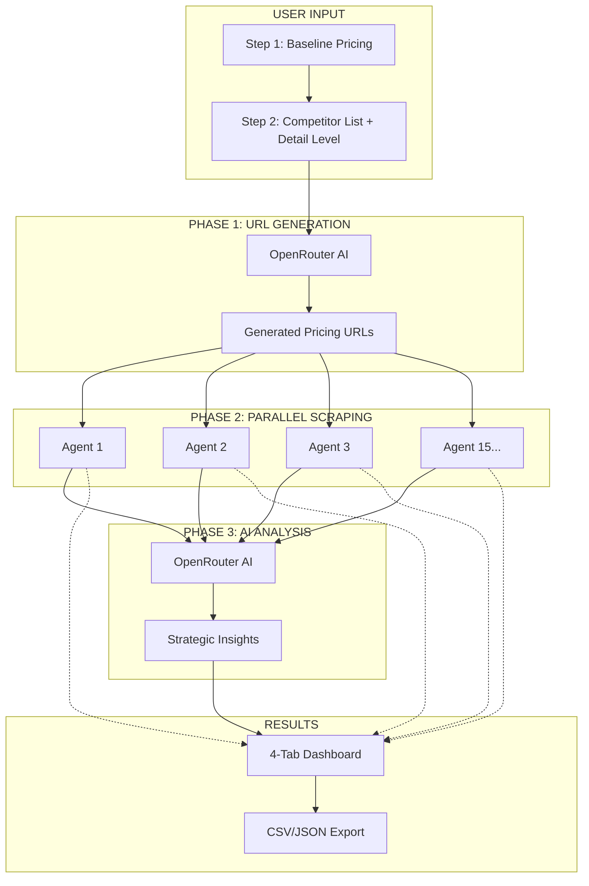
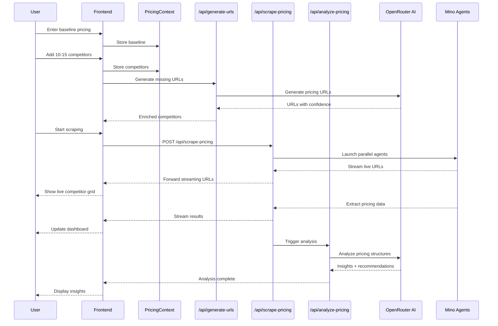
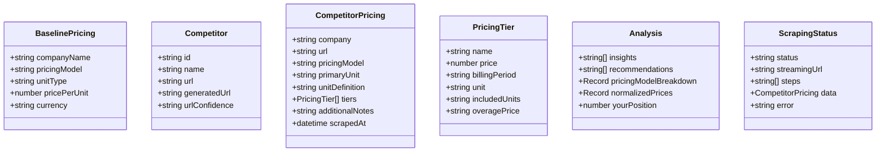

# TinyFish - Competitive Pricing Intelligence Dashboard

**Live Demo:** https://competitor-priceanalysis.vercel.app/

A comprehensive competitive pricing intelligence platform that helps product and sales teams track competitor pricing across 10-15 competitors simultaneously. Uses the **Source → Extract → Present** pipeline pattern with AI-powered URL generation, parallel Mino browser agents for scraping, and intelligent analysis to provide strategic market insights.

**Status**: ✅ Working

---

## Demo

*[Demo video/screenshot to be added]*

---

## How Mino API is Used

The Mino API powers browser automation for this use case. See the code snippet below for implementation details.

### Code Snippet

```bash
npm install
export TINYFISH_API_KEY=your_key
export OPENROUTER_API_KEY=your_key
npm run dev
```

---

## How to Run

### Prerequisites

- Node.js 18+
- Mino API key (get from [mino.ai](https://mino.ai))

### Setup

1. Clone the repository:
```bash
git clone https://github.com/tinyfish-io/TinyFish-cookbook
cd TinyFish-cookbook/competitor-analysis
```

2. Install dependencies:
```bash
npm install
```

3. Create `.env.local` file:
```bash
TINYFISH_API_KEY=xxx          # Browser automation
OPENROUTER_API_KEY=xxx    # AI URL generation + pricing analysis
```

4. Run the development server:
```bash
npm run dev
```

5. Open [http://localhost:3000](http://localhost:3000) in your browser

---

## Architecture Diagram








