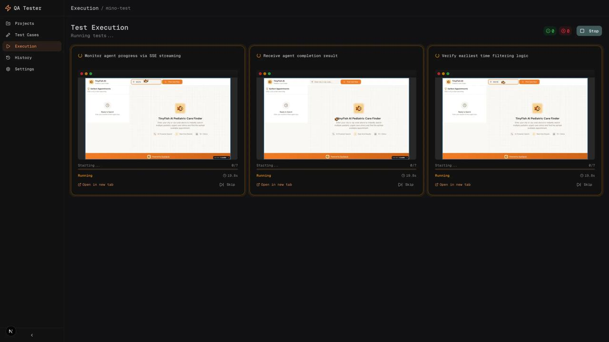
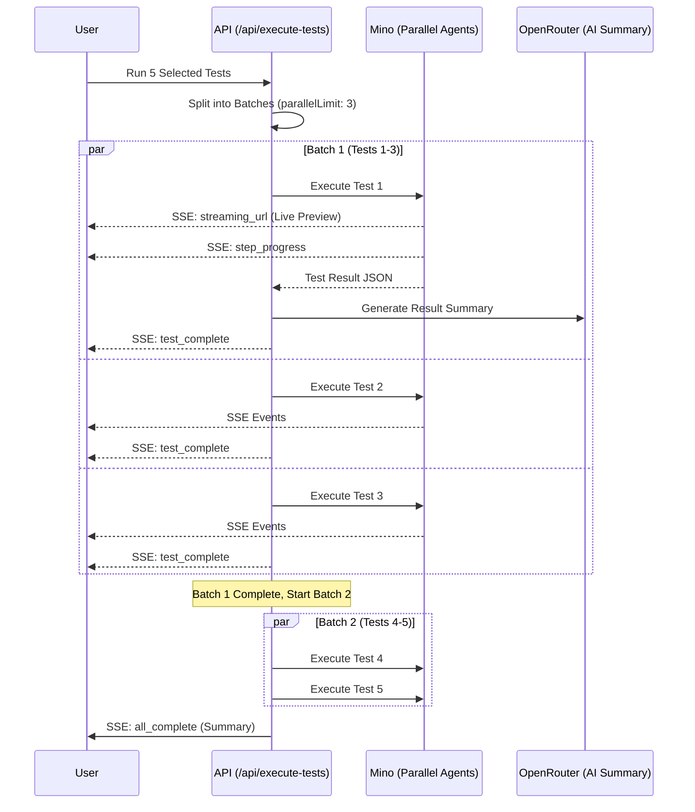

# Fast QA - No-Code Testing Dashboard

**Live Demo:** https://fastqa.vercel.app/

Fast QA is a no-code QA testing platform where users describe tests in plain English, AI converts them to structured test cases, and **Mino API** executes all tests in parallel with live browser previews. The system tracks pass/fail rates and generates AI-powered bug reports for failures.

---

## Demo



*Parallel test execution with live browser previews and real-time SSE streaming*

---

## How Mino API is Used

The Mino API powers the parallel browser automation for test execution. Each test case sends a structured goal prompt to Mino, which executes the steps in a real browser and streams back live progress + results.

### Code Snippet

From `app/api/execute-tests/route.ts`:

```typescript
// Execute tests in batches based on parallelLimit
const batches: TestCase[][] = [];
for (let i = 0; i < testCases.length; i += parallelLimit) {
  batches.push(testCases.slice(i, i + parallelLimit));
}

for (const batch of batches) {
  // Execute batch in parallel
  const batchPromises = batch.map(async (testCase) => {
    const result = await executeTestCase(testCase, websiteUrl, apiKey, settings, sendEvent);
    results.push(result);
    return result;
  });
  await Promise.all(batchPromises);
}

// Individual test execution with Mino
async function executeTestCase(testCase, websiteUrl, apiKey, settings, sendEvent) {
  const goal = buildGoalFromTestCase(testCase);
  
  const minoResponse = await runMinoAutomation({
    url: websiteUrl,
    goal, // Structured test prompt with expected outcome
    browser_profile: settings?.browserProfile || "lite",
  }, apiKey, {
    onStreamingUrl: async (streamingUrl) => {
      await sendEvent({ type: "streaming_url", testCaseId, data: { streamingUrl } });
    },
    onStep: async (step) => {
      await sendEvent({ type: "step_progress", testCaseId, data: { stepDescription: step } });
    },
  });
  // ... process result and send test_complete event
}
```

### Example Mino Goal Prompt

```markdown
Navigate to the login page at /login. Enter "user@example.com" in the email field and "SecurePass123" in the password field. Click the "Sign In" button.

Expected outcome: User should be logged in and redirected to the dashboard page showing "Welcome back, User".

After completing the steps, verify that the expected outcome is met. Return a JSON object with { "success": true/false, "reason": "explanation" }
```

---

## How to Run

### Prerequisites

- Node.js 18+
- Mino API key (get from [mino.ai](https://mino.ai))
- OpenRouter API key (for AI test generation)

### Setup

1. Clone the repository:
```bash
git clone https://github.com/tinyfish-io/TinyFish-cookbook
cd TinyFish-cookbook/fast-qa
```

2. Install dependencies:
```bash
npm install
```

3. Create `.env.local` file:
```bash
# Mino API Key (required for test execution)
TINYFISH_API_KEY=sk-mino-...

# OpenRouter API Key (required for AI test generation)
OPENROUTER_API_KEY=sk-or-...
```

4. Run the development server:
```bash
npm run dev
```

5. Open [http://localhost:3000](http://localhost:3000) in your browser

---

## Architecture Diagram

### System Overview

```mermaid
graph TD
    subgraph Frontend [Next.js Client]
        UI[Dashboard UI - Projects/Tests/Execution]
        Context[QA Context - State Management]
        LS[(LocalStorage - Persistence)]
    end

    subgraph Backend [Next.js API Routes]
        GenTests[/api/generate-tests]
        ExecTests[/api/execute-tests]
        GenReport[/api/generate-report]
    end

    subgraph External_APIs [External Services]
        OpenRouter[OpenRouter AI - MiniMax M2.1]
        Mino[Mino API - Browser Automation]
    end

    %% User Interactions
    UI -->|Plain English Tests| GenTests
    UI -->|Run Selected Tests| ExecTests
    UI -->|Request Bug Report| GenReport
    
    %% State Management
    Context <-->|Read/Write| LS
    
    %% AI Services
    GenTests -->|Generate Test Cases| OpenRouter
    GenReport -->|Generate Bug Report| OpenRouter
    
    %% Automation
    ExecTests -->|Parallel Execution| Mino
    Mino --.->|SSE: Live Preview + Progress| UI
    Mino --.->|Test Results JSON| ExecTests
    ExecTests --.->|Consolidated SSE| UI
```

### Parallel Execution Flow



---

## Key Features

- **AI Test Generation** - Paste requirements → AI generates structured test cases
- **Parallel Execution** - Run up to 10 tests simultaneously
- **Live Browser Previews** - Watch tests execute in real-time via Mino streaming
- **AI Result Summaries** - Detailed pass/fail explanations
- **Bug Report Generation** - AI-powered bug reports with severity & reproduction steps
- **Project Management** - Organize tests by project/website
- **Persistent Storage** - LocalStorage for session continuity
