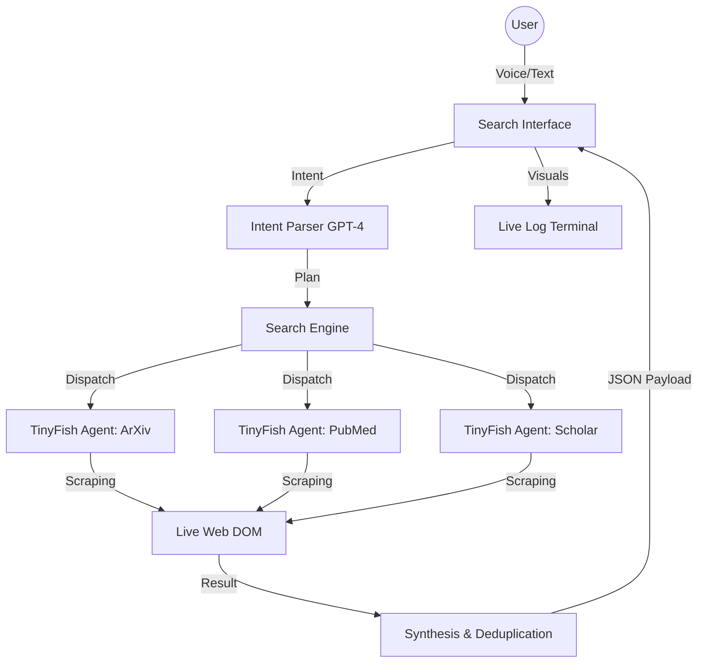

# Research Sentry

Live link: https://voice-research.vercel.app/

## What it is
Research Sentry is a voice-first academic research co-pilot that scans live portals (ArXiv, PubMed, Semantic Scholar, IEEE Xplore, and more) to assemble verified paper metadata and summaries. It uses the TinyFish Web Agent to automate multi-step portal navigation and extract structured results in real time.

## Demo video
https://voice-research.vercel.app/

## TinyFish API usage (snippet)
```ts
const res = await fetch("https://agent.tinyfish.ai/v1/automation/run-sse", {
  method: "POST",
  headers: {
    "X-API-Key": process.env.TINYFISH_API_KEY!,
    "Content-Type": "application/json",
  },
  body: JSON.stringify({
    url,
    goal,
    browser_profile: stealth ? "stealth" : "lite",
  }),
});
```

## How to run
1. Install deps: `npm install`
2. Create `.env.local`:
```
TINYFISH_API_KEY=your_tinyfish_key
OPENAI_API_KEY=your_openai_key
```
3. Start dev server: `npm run dev`

## Architecture diagram

