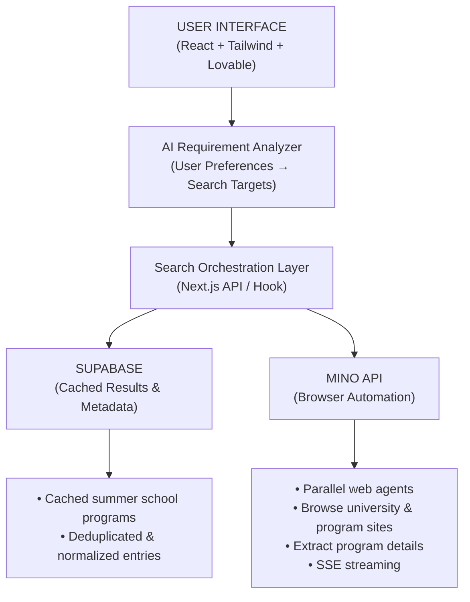

# Project Title - Summer School Comparison tool 

**Live Link**: https://tinyfishsummerschool.lovable.app

## About the project - 
An AI-powered web app that discovers and compares summer school programs from universities around the world in one place. It uses the TinyFish API to automatically browse official program websites in parallel, extract key details in real time, and present up-to-date, structured results to users.

**Demo Video** - https://drive.google.com/file/d/1IHkVxF453SXV3uecvxbeUDMIMr1rTtX7/view?usp=sharing


## Code snippet - 
```bash
const response = await fetch("https://agent.tinyfish.ai/v1/automation/run-sse", {
  method: "POST",
  headers: {
    "Content-Type": "application/json",
    "X-API-Key": "sk-mino-YOUR_API_KEY",
  },
  body: JSON.stringify({
    url: "https://www.example-summerschool.com/programs",
    goal: "Extract the top 3–5 summer school programs. Return JSON with schoolName, programName, startDate, endDate, location, ageGroup, fees, applicationDeadline, programFocus, eligibilityCriteria, officialProgramURL.",
    browser_profile: "lite",
  }),
});

const reader = response.body!.getReader();
const decoder = new TextDecoder();

while (true) {
  const { done, value } = await reader.read();
  if (done) break;

  const chunk = decoder.decode(value);
  for (const line of chunk.split("\n")) {
    if (line.startsWith("data: ")) {
      const data = JSON.parse(line.slice(6));

      if (data.streamingUrl) {
        console.log("Live view:", data.streamingUrl);
      }

      if (data.type === "COMPLETE" && data.resultJson) {
        console.log("Result:", data.resultJson);
      }
    }
  }
}
```


## Tech Stack
**Next.js (TypeScript)**

**Mino API**

**AI**

## Architecture Diagram

