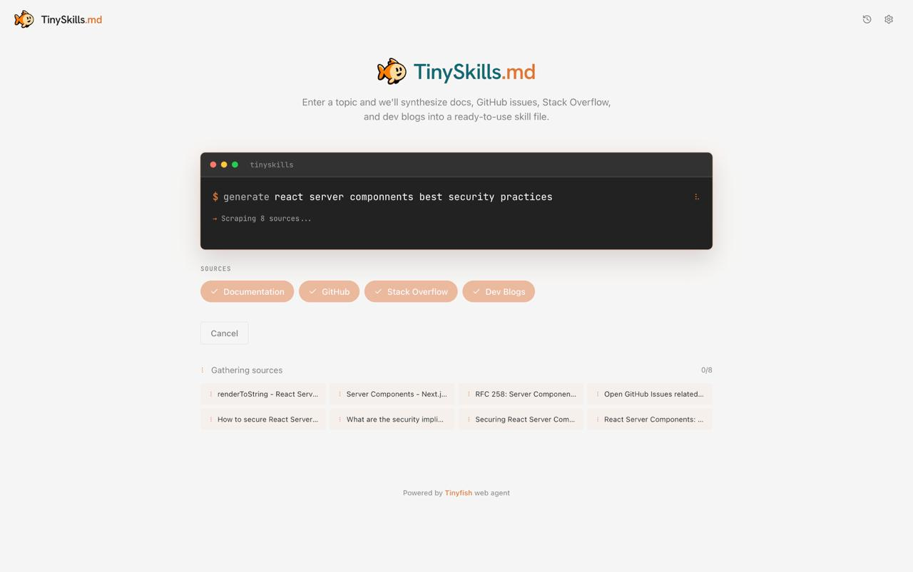

# TinySkills

**Live:** [https://tinyskills.vercel.app](https://tinyskills.vercel.app)

TinySkills generates comprehensive technical skill guides by scraping multiple source types (official documentation, GitHub issues, Stack Overflow, and dev blogs) in parallel using TinyFish, then synthesizing everything with AI into a ready-to-use markdown skill guide. Perfect for quickly learning new technologies or creating documentation.

## Demo



## How It Works

1. **Identify Sources** — Given a topic (e.g., "React Server Components"), the app uses AI to find 8 relevant URLs across 4 source types (2 per type)
2. **Parallel Scraping** — TinyFish dispatches web agents to all 8 sources simultaneously, extracting structured content from each
3. **AI Synthesis** — All scraped content is consolidated and synthesized into a comprehensive, well-organized skill guide

## TinyFish API Usage

The app uses TinyFish's SSE endpoint to scrape multiple sources in parallel. Each source type has a specialized extraction prompt:

### Scraping Documentation

```typescript
const result = await runMinoAutomation(
  {
    url: "https://react.dev/reference/rsc/server-components",
    goal: `Extract technical documentation content about "react server components".
    
TASK: Scrape the main content from this documentation page.

Extract:
1. Main concepts and explanations
2. API methods, parameters, return types
3. Code examples and usage patterns
4. Important notes, warnings, or tips
5. Links to related topics

Return JSON:
{
  "title": "Page title",
  "content": "Full extracted content in markdown format",
  "codeExamples": ["code snippet 1", "code snippet 2"],
  "keyPoints": ["important point 1", "important point 2"]
}`,
    browser_profile: "lite",
  },
  apiKey,
  {
    onStep: async (message) => {
      // Real-time progress updates
      await sendEvent({ type: "source_step", sourceUrl: source.url, detail: message });
    },
    onStreamingUrl: async (url) => {
      // Live browser view URL
      await sendEvent({ type: "source_streaming", sourceUrl: source.url, streamingUrl: url });
    },
  }
);
```

### Parallel Scraping Pattern

From `app/api/scrape-sources/route.ts`:

```typescript
// Scrape all sources in parallel
const scrapePromises = sources.map(async (source) => {
  const goal = buildScrapeGoal(source.type, topic);
  
  const result = await runMinoAutomation(
    {
      url: source.url,
      goal,
      browser_profile: settings?.browserProfile || "lite",
    },
    apiKey,
    {
      onStep: async (message) => {
        await sendEvent({ type: "source_step", sourceUrl: source.url, detail: message });
      },
      onStreamingUrl: async (url) => {
        await sendEvent({ type: "source_streaming", sourceUrl: source.url, streamingUrl: url });
      },
    }
  );
  
  return { source, content: parseScrapedContent(result.result), success: result.success };
});

// Wait for all scrapes to complete
const results = await Promise.allSettled(scrapePromises);
```

The app streams real-time progress for all 8 parallel scraping operations, showing:
- Source being scraped
- Current step ("Extracting main content...", etc.)
- Live streaming URL to watch the agent navigate
- Word count of extracted content
- Final aggregated results

## How to Run

### Prerequisites

- Node.js 18+ (or Bun)
- A TinyFish API key ([get one here](https://mino.ai/api-keys))
- OpenRouter API key for AI synthesis ([get one here](https://openrouter.ai))

### Setup

1. Clone the repository:

```bash
git clone https://github.com/pranavjana/mino-tinyskills.git
cd mino-tinyskills
```

2. Install dependencies:

```bash
npm install
```

3. Create a `.env.local` file with your API keys:

```
MINO_API_KEY=your_tinyfish_api_key_here
OPENROUTER_API_KEY=your_openrouter_api_key_here
```

4. Start the dev server:

```bash
npm run dev
```

5. Open [http://localhost:3000](http://localhost:3000)

## Architecture

```
┌─────────────────────────────────────────────────────────┐
│                     User (Browser)                       │
│  ┌─────────────────────────────────────────────────┐    │
│  │     Next.js Frontend (Terminal-style UI)        │    │
│  │                                                  │    │
│  │  1. Enter topic: "react server components"      │    │
│  │  2. Select source types (Docs/GitHub/SO/Blogs)  │    │
│  │  3. Click "Generate"                            │    │
│  └──────────────────┬──────────────────────────────┘    │
└─────────────────────┼───────────────────────────────────┘
                      │
                      ▼
           ┌─────────────────────┐
           │ /api/identify-sources│
           │   (AI finds URLs)    │
           └──────────┬───────────┘
                      │ 8 URLs (2 per source type)
                      ▼
           ┌─────────────────────┐
           │ /api/scrape-sources  │
           │  (Parallel scraping) │
           └──────────┬───────────┘
                      │ POST to TinyFish (x8, parallel)
                      ▼
┌─────────────────────────────────────────────────────────┐
│                  TinyFish API (mino.ai)                  │
│                                                          │
│  8 parallel web agents, each with specialized prompts:   │
│    • Docs → Extract APIs, examples, concepts            │
│    • GitHub → Extract issues, solutions, gotchas        │
│    • StackOverflow → Extract Q&A, common mistakes       │
│    • Blogs → Extract tutorials, best practices          │
│                                                          │
│  SSE Stream Events:                                      │
│    • STEP → "Extracting main content..."                │
│    • STREAMING_URL → live browser view                   │
│    • COMPLETE → extracted JSON content                   │
└────────┬────────────────┬──────────────┬────────────────┘
         │                │              │
         ▼                ▼              ▼
   ┌──────────┐    ┌──────────┐   ┌──────────┐
   │React Docs│    │  GitHub  │   │Stack Over│  ... (8 sources)
   └──────────┘    └──────────┘   └──flow────┘
                      │
                      │ All content extracted
                      ▼
           ┌─────────────────────┐
           │  /api/synthesize     │
           │  (AI consolidation)  │
           └──────────┬───────────┘
                      │ Streaming markdown output
                      ▼
           ┌─────────────────────┐
           │  Generated Skill     │
           │  Guide (markdown)    │
           └─────────────────────┘
```

## Key Features

| Feature | Description |
|---------|-------------|
| **Multi-Source Synthesis** | Combines docs, GitHub issues, Stack Overflow, and blogs |
| **AI-Powered Discovery** | Automatically finds relevant URLs for each source type |
| **Parallel Scraping** | Scrapes all sources simultaneously using TinyFish |
| **Live Progress** | Real-time SSE updates with streaming URLs |
| **Streaming Output** | Skill guide generated incrementally as text streams |
| **Local History** | All generations saved to localStorage |
| **Source-Specific Prompts** | Tailored extraction for each content type |

## Example Output

When generating a guide for "React Server Components", TinySkills will:

1. Find 2 official React docs pages
2. Find 2 relevant GitHub issues/discussions
3. Find 2 Stack Overflow Q&As
4. Find 2 blog posts/tutorials

Then scrape all 8 in parallel, extracting:
- API documentation and type definitions
- Common issues and solutions from GitHub
- Frequent questions and answers from Stack Overflow
- Best practices and tutorials from blogs

Finally, synthesize everything into a comprehensive skill guide with:
- Overview and key concepts
- API reference with examples
- Common gotchas and solutions
- Best practices and patterns
- Code examples from all sources
